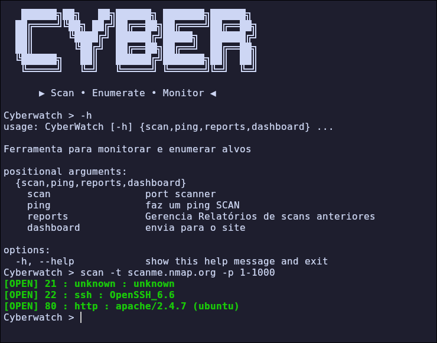
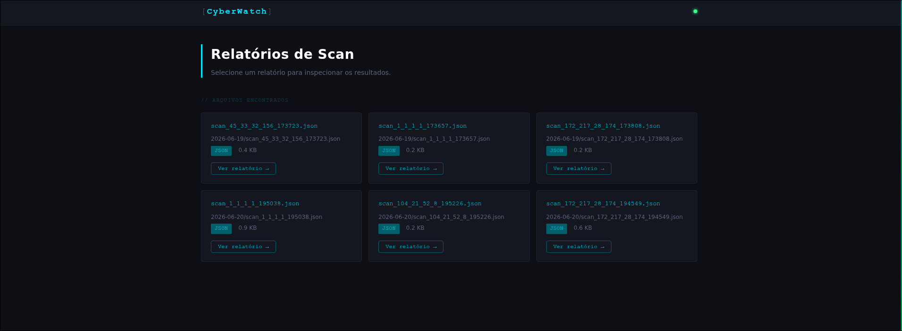

# CyberWatch

> Network scanning and service enumeration tool written in Python.

CyberWatch is an interactive CLI tool for TCP port scanning, service fingerprinting, banner grabbing, HTTP enumeration, and DNS resolution. Built as a hands-on learning project in offensive security fundamentals.

---

## Features

- **TCP Port Scanner** — scan single ports, ranges (`1-1000`), or comma-separated lists (`22,80,443`)
- **Service Fingerprinting** — identifies SSH, HTTP, HTTPS, FTP, SMTP, and Telnet from banner responses
- **Version Detection** — parses specific version strings (e.g. `OpenSSH_9.3`, `Apache/2.4.7`)
- **Banner Grabbing** — raw banner capture with `--banner`
- **HTTP/HTTPS Enumeration** — extracts page title and `Content-Type` with `--web-enum`
- **DNS Resolution** — accepts hostnames or IPs as targets
- **Threaded Scanning** — configurable thread pool via `--threads` (default: 100)
- **Host Discovery** — `ping` command for single-host checks or full `/24` network sweeps
- **JSON and CSV Export** — save results to `reports/` with `--output`
- **Report Management** — `reports` command lists saved scans or shows the latest report for a target
- **Web Dashboard** — local Flask dashboard (`dashboard` command) to browse saved reports in the browser
- **Interactive Shell** — persistent session with history support

---

## Screenshots

**CLI — scan in action**


**Web Dashboard**


---

## Project Structure

```
CyberWatch/
├── main.py
├── core/
│   ├── banner.py             # ASCII banner display
│   └── parser.py             # CLI argument parser
├── modules/
│   ├── scanner/
│   │   ├── port_scanner.py      # Core scanner with ThreadPoolExecutor
│   │   ├── banner_grabber.py    # Protocol-specific banner grabbing
│   │   ├── fingerprint.py       # Service identification from banner
│   │   ├── version_detection.py # Version string parsing per service
│   │   ├── http_enum.py         # HTTP title and content-type extraction
│   │   ├── dns_target.py        # DNS resolution / IP validation
│   │   └── ping.py              # Host discovery (single host / network sweep)
│   ├── report/
│   │   ├── report_manager.py    # JSON/CSV report saving and retrieval
│   │   └── server.py            # Flask app serving the web dashboard
│   └── dashboard/
│       └── dashboard.py         # Launches the Flask dashboard and opens the browser
└── tests/                    # pytest test suite
```

---

## Requirements

- Python 3.10+
- [Flask](https://pypi.org/project/Flask/) >= 3.1.3 (web dashboard)
- [colorama](https://pypi.org/project/colorama/) >= 0.4.6 (colored terminal output)
- readline (Linux)
- pyreadline3 (Windows)

Install dependencies with:

```bash
pip install -r requirements.txt
```

---

## Installation

```bash
git clone https://github.com/calebe-sec/CyberWatch.git
cd CyberWatch
python main.py
```

---

## Usage

Start the interactive shell:

```
$ python main.py
CyberWatch > 
```

### Basic Scan

```
CyberWatch > scan -t scanme.nmap.org -p 22,80,443
[OPEN] 22 : ssh : OpenSSH_8.9p1
[OPEN] 80 : http : apache/2.4.7 (ubuntu)
[OPEN] 443 : https : apache/2.4.7 (ubuntu)
```

### Port Range

```
CyberWatch > scan -t 192.168.1.1 -p 1-1000
```

### Banner Grabbing

```
CyberWatch > scan -t scanme.nmap.org -p 22 --banner
```

### HTTP Enumeration

```
CyberWatch > scan -t scanme.nmap.org -p 80 --web-enum
[OPEN] 80 : http : apache/2.4.7 (ubuntu)
  ├─ Title: Go ahead and ScanMe!
  └─ Content-Type: text/html
```

### Custom Timeout and Threads

```
CyberWatch > scan -t 10.0.0.1 -p 1-65535 --timeout 3 --threads 200
```

### Export Results to JSON and CSV

```
CyberWatch > scan -t scanme.nmap.org -p 1-1000 --output
[*] Relatório CSV salvo em: reports/2026-06-20/scan_scanme_nmap_org_153012.csv
[*] Relatório json salvo em: reports/2026-06-20/scan_scanme_nmap_org_153012.json
```

### Host Discovery (Ping)

Single host:

```
CyberWatch > ping 192.168.1.1
192.168.1.1 -> ativo
```

Full `/24` network sweep:

```
CyberWatch > ping 192.168.1.0/24
192.168.1.1 -> ativo
192.168.1.34 -> ativo
192.168.1.254 -> ativo
```

### Viewing Reports

List every saved report, grouped by date:

```
CyberWatch > reports

 2026-06-20 (2 arquivos)
     └─ scan_scanme_nmap_org_153012.csv
     └─ scan_scanme_nmap_org_153012.json
```

Show the latest report for a specific target:

```
CyberWatch > reports -t scanme.nmap.org

[*] Último relatório de 'scanme.nmap.org':
PORT     STATUS   SERVICE         VERSION
--------------------------------------------------
22       open     ssh             OpenSSH_8.9p1
80       open     http            apache/2.4.7
```

### Web Dashboard

Launches a local Flask server and opens it in your browser to browse saved reports visually:

```
CyberWatch > dashboard
TENTANDO ABRIR O DASHBOARD
```

Opens automatically at `http://127.0.0.1:5000`. Type `quit` or `exit` to stop the server.

---

## Supported Services

| Service | Detection Method         |
|---------|--------------------------|
| SSH     | OpenSSH version string   |
| HTTP    | Server header            |
| HTTPS   | Server header (SSL)      |
| FTP     | vsFTPd, ProFTPD, FileZilla, etc. |
| SMTP    | Postfix, Sendmail, Exchange, etc. |
| Telnet  | OS/device fingerprint    |

---

## Options Reference

```
scan -t TARGET [options]

  -t, --target     Target IP or hostname (required)
  -p, --ports      Ports to scan. Ex: 80, 1-1000, 22,80,443 (default: 1-1000)
  --timeout        Timeout per port in seconds (default: 5)
  --threads        Number of parallel threads (default: 100)
  --banner         Enable raw banner grabbing
  --web-enum       Enumerate HTTP/HTTPS services (title, content-type)
  --output         Save results to reports/ as JSON and CSV
```

---

## Testing

The project includes a `pytest` test suite covering the scanner, fingerprinting, and report modules:

```bash
pip install pytest
pytest
```

---

## Roadmap

- [x] TCP Port Scanner
- [x] Banner Grabbing
- [x] DNS Resolution
- [x] Service Fingerprinting
- [x] Version Detection
- [x] HTTP/HTTPS Enumeration
- [x] Interactive Shell
- [x] Configurable Thread Pool
- [x] JSON/CSV Export
- [x] Host Discovery (ping sweep)
- [x] Report Management (CLI)
- [x] Web Dashboard
- [ ] Subdomain Enumeration
- [ ] UDP Scan
- [ ] OS Detection
- [ ] CVE Lookup Integration

---

## Disclaimer

This tool is intended for **educational purposes and authorized security assessments only**.  
Always obtain explicit permission before scanning systems you do not own.

---

## Author

**Calebe Araújo (Anosh)** — Cybersecurity Student  
[GitHub](https://github.com/calebe-sec) · [TryHackMe](https://tryhackme.com/p/Anosh)